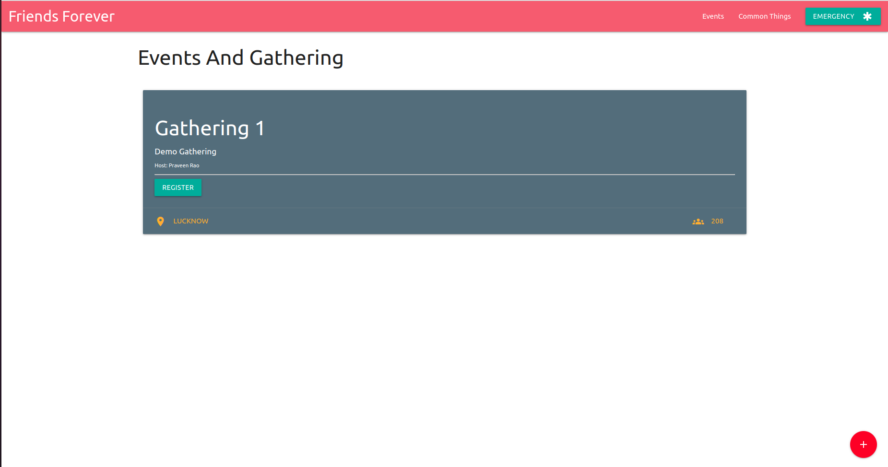
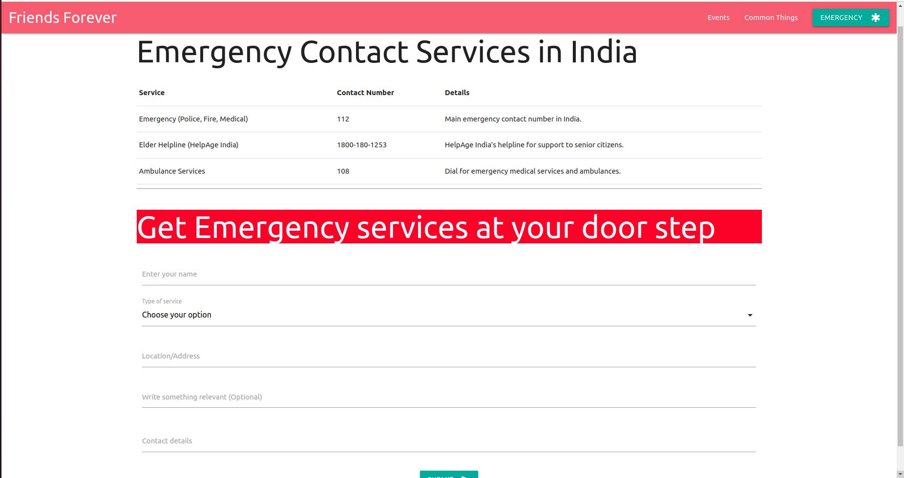
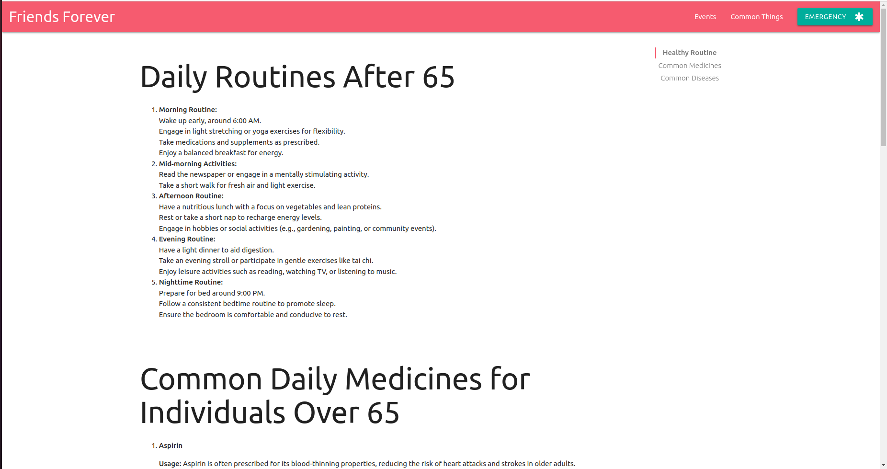

Friends Forever
=======================

Welcome to SeniorWellness, a user-friendly web application designed to enhance the quality of life for senior citizens by fostering community engagement and providing essential services. This application empowers seniors to create and join events tailored to their preferences, promoting social connections and a vibrant lifestyle.

***

# Getting started

1. Clone the project
> git clone https://github.com/kus0023/friendsforever.git
2. move to directory
>cd friendsforever
3. Install the dependecies
> npm install
4. Run the project
> npm start

***

## Screenshots

1. Events Page

2. Emergency services

3. common Things page

